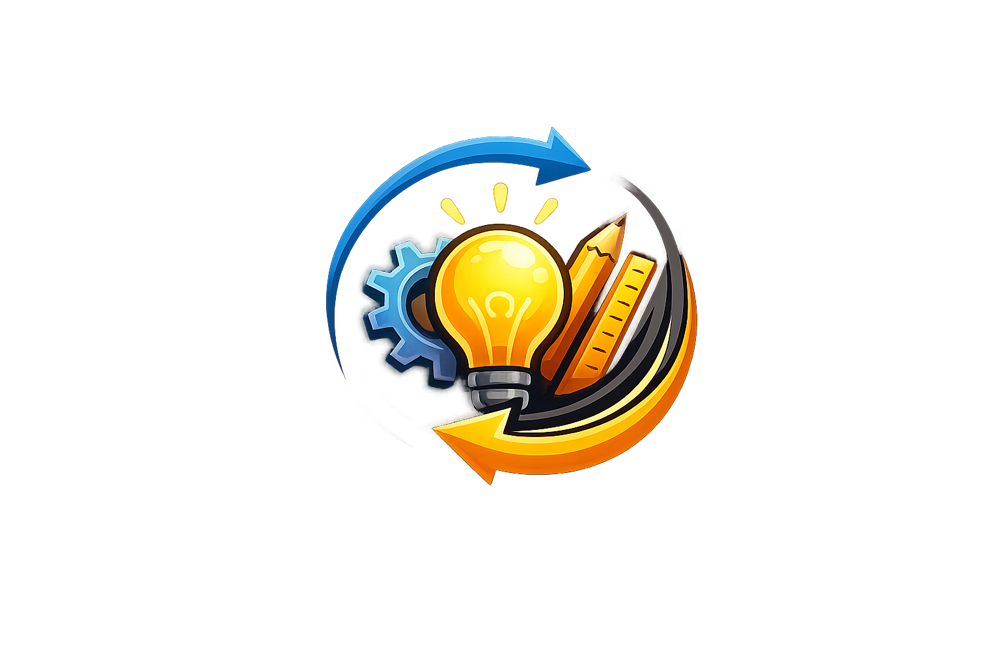

<p align="center" style="margin-bottom: 0;">
  
</p>

<h1 align="center" style="margin-top: 0.5rem; margin-bottom: 0.5rem;">skillshare</h1>

<p align="center">
  <a href="https://skillshare.runkids.cc"></a>
  <a href="LICENSE"></a>
  <a href="go.mod"></a>
  <a href="https://github.com/runkids/skillshare/releases"></a>
  
  <a href="https://goreportcard.com/report/github.com/runkids/skillshare"></a>
  <a href="https://deepwiki.com/runkids/skillshare"></a>
</p>

<p align="center">
  <a href="https://github.com/runkids/skillshare/stargazers"></a>
</p>

<p align="center">
  <strong>One source of truth for AI CLI skills. Sync everywhere with one command — from personal to organization-wide.</strong><br>
  Claude Code, OpenClaw, OpenCode & 40+ more.
</p>

<p align="center">
  
</p>

<p align="center">
  <a href="https://skillshare.runkids.cc">Website</a> •
  <a href="#installation">Install</a> •
  <a href="#quick-start">Quick Start</a> •
  <a href="#cli-and-ui-preview">Screenshots</a> •
  <a href="#common-workflows">Commands</a> •
  <a href="#web-dashboard">Web UI</a> •
  <a href="#project-skills-per-repo">Project Skills</a> •
  <a href="#organization-skills-tracked-repo">Organization Skills</a> •
  <a href="https://skillshare.runkids.cc/docs">Docs</a>
</p>

> [!NOTE]
> **Recent Updates**
> | Version | Highlights |
> |---------|------------|
> | [0.11.0](https://github.com/runkids/skillshare/releases/tag/v0.11.0) | Security Audit, Operation Log, Trash, Update Preview — full audit trail + safety net |
> | [0.10.0](https://github.com/runkids/skillshare/releases/tag/v0.10.0) | Web Dashboard — visual skill management via `skillshare ui` |
> | [0.9.0](https://github.com/runkids/skillshare/releases/tag/v0.9.0) | Project-level skills — scope skills to a single repo, share via git |

## Why skillshare

Stop managing skills tool-by-tool.
`skillshare` gives you one shared skill source and pushes it everywhere your AI agents work.

- **One command, everywhere**: Sync to Claude Code, Codex, Cursor, OpenCode, and more with `skillshare sync`.
- **Safe by default**: Non-destructive merge mode keeps CLI-local skills intact while sharing team skills.
- **True bidirectional flow**: Pull skills back from targets with `collect` so improvements never get trapped in one tool.
- **Cross-machine ready**: Git-native `push`/`pull` keeps all your devices aligned.
- **Team + project friendly**: Use global skills for personal workflows and `.skillshare/` for repo-scoped collaboration.
- **Folder-friendly**: Organize skills in folders (e.g. `frontend/react/`) — auto-flattened to flat names on sync.
- **Privacy-first**: No central registry, no telemetry, no install tracking. Your skill setup stays entirely local.
- **Built-in security audit**: Scan skills for prompt injection, data exfiltration, and other threats before they reach your AI agent.
- **Visual control panel**: Open `skillshare ui` for browsing, install, target management, and sync status in one place.

## Comparison

skillshare uses a **declarative** approach: define your targets once in `config.yaml`, then `sync` handles everything — no prompts, no repeated selections.

| | Imperative (install-per-command) | Declarative (skillshare) |
|---|---|---|
| **Config** | No config; prompts every run | `config.yaml` — set once |
| **Agent selection** | Interactive prompt each time | Defined in config |
| **Install method** | Choose per operation | `sync_mode` in config |
| **Source of truth** | Skills copied independently | Single source → symlinks |
| **Remove one agent's skill** | May break other agents' symlinks | Only that target's symlink removed |
| **New machine setup** | Re-run every install manually | `git clone` config + `sync` |
| **Project-scoped skills** | Global lock file only | `init -p` for per-repo skills |
| **Cross-machine sync** | Manual | Built-in `push` / `pull` |
| **Bidirectional** | Install only | `collect` pulls changes back |
| **Security audit** | None | Built-in `audit` + auto-scan on install |
| **Web dashboard** | None | `skillshare ui` |
| **Runtime dependency** | Node.js + npm | None (single Go binary) |

> [!TIP]
> Coming from another tool? See the [Migration Guide](https://skillshare.runkids.cc/docs/guides/migration) and [detailed comparison](https://skillshare.runkids.cc/docs/guides/comparison).

## How It Works
- macOS / Linux: `~/.config/skillshare/skills/`
- Windows: `%USERPROFILE%\.config\skillshare\skills\`

```
┌─────────────────────────────────────────────────────────────┐
│                       Source Directory                      │
│                 ~/.config/skillshare/skills/                │
└─────────────────────────────────────────────────────────────┘
                              │ sync
              ┌───────────────┼───────────────┐
              ▼               ▼               ▼
       ┌───────────┐   ┌───────────┐   ┌───────────┐
       │  Claude   │   │  OpenCode │   │ OpenClaw  │   ...
       └───────────┘   └───────────┘   └───────────┘
```

| Platform | Source Path | Link Type |
|----------|-------------|-----------|
| macOS/Linux | `~/.config/skillshare/skills/` | Symlinks |
| Windows | `%USERPROFILE%\.config\skillshare\skills\` | NTFS Junctions (no admin required) |

> [!TIP]
> Skills can be organized in folders (e.g. `frontend/react/react-best-practices/`) — they're auto-flattened on sync. See the [Organizing Guide](https://skillshare.runkids.cc/docs/guides/organizing-skills) and [runkids/my-skills](https://github.com/runkids/my-skills) for a real-world example.


## CLI and UI Preview

### CLI

| Sync | Install + Audit |
|---|---|
|  |  |

### UI

| Dashboard | Security Audit |
|---|---|
|  |  |

## Installation

### macOS / Linux

```bash
curl -fsSL https://raw.githubusercontent.com/runkids/skillshare/main/install.sh | sh
```

### Windows PowerShell

```powershell
irm https://raw.githubusercontent.com/runkids/skillshare/main/install.ps1 | iex
```

### Homebrew

```bash
brew install runkids/tap/skillshare
```

### Shorthand (Optional)

Add an alias to your shell config (`~/.zshrc` or `~/.bashrc`):

```bash
alias ss='skillshare'
```

### Uninstall

```bash
# macOS/Linux
brew uninstall skillshare               # Homebrew
sudo rm /usr/local/bin/skillshare       # Manual install
rm -rf ~/.config/skillshare             # Config & data (optional)

# Windows (PowerShell)
Remove-Item "$env:LOCALAPPDATA\Programs\skillshare" -Recurse -Force
Remove-Item "$env:USERPROFILE\.config\skillshare" -Recurse -Force  # optional
```

---

## Quick Start

```bash
skillshare init --dry-run  # Preview setup
skillshare init            # Create config, source, and detected targets
skillshare sync            # Sync skills to all targets
```

## Common Workflows

### Daily Commands

| Command | What it does |
|---------|---------------|
| `skillshare list` | List skills in source |
| `skillshare status` | Show sync status for all targets |
| `skillshare sync` | Sync source skills to all targets |
| `skillshare diff` | Preview differences before syncing |
| `skillshare doctor` | Diagnose config/environment issues |
| `skillshare new <name>` | Create a new skill template |
| `skillshare install <source>` | Install skill from local path or git source |
| `skillshare collect [target]` | Import skills from target(s) back to source |
| `skillshare update <name>` | Update one installed skill/repo |
| `skillshare update --all` | Update all tracked repos |
| `skillshare uninstall <name>` | Remove skill from source |
| `skillshare audit [name]` | Scan skills for security threats |
| `skillshare log` | View operations and audit logs for debugging and compliance |
| `skillshare search <query>` | Search installable skills on GitHub |

`skillshare search` requires GitHub auth (`gh auth login`) or `GITHUB_TOKEN`.

### Target Management

```bash
skillshare target list
skillshare target add my-tool ~/.my-tool/skills
skillshare target remove my-tool
```

### Backup and Restore

```bash
skillshare backup
skillshare backup --list
skillshare restore <target>
```

### Cross-machine Git Sync

```bash
skillshare push
skillshare pull
```

### Project Skills (Per Repo)

```bash
skillshare init -p
skillshare new my-skill -p
skillshare install anthropics/skills/skills/pdf -p
skillshare install github.com/team/skills --track -p
skillshare sync
```

Project mode keeps skills in `.skillshare/skills/` so they can be committed and shared with the repo. The `config.yaml` acts as a **portable skill manifest** — anyone who clones the repo (team members, open source contributors, community users) can reproduce the exact same AI skill setup:

```bash
git clone github.com/your/project && cd project
skillshare install -p    # Installs all skills listed in config (tracked repos included)
skillshare sync
```

### Organization Skills (Tracked Repo)

```bash
skillshare install github.com/team/skills --track
skillshare update _team-skills
skillshare sync
```

## Web Dashboard

```bash
skillshare ui            # Global mode
skillshare ui -p         # Project mode (manages .skillshare/)
```

- Opens `http://127.0.0.1:19420`
- Requires `skillshare init` (or `init -p` for project mode) first
- Auto-detects project mode when `.skillshare/config.yaml` exists
- Runs from the same CLI binary (no extra frontend setup)

For containers/remote hosts:

```bash
skillshare ui --host 0.0.0.0 --no-open
```

Then access: `http://localhost:19420`

## Security Audit

Scan installed skills for prompt injection, data exfiltration, credential theft, and other threats before they reach your AI agent.

```bash
skillshare audit            # Scan all skills
skillshare audit <name>     # Scan a specific skill
```

CRITICAL findings block installation by default. Use `--force` to override.

Skills are also scanned automatically during `skillshare install`.

> [!TIP]
> See the [audit command reference](https://skillshare.runkids.cc/docs/commands/audit) for the full list of detection patterns.

## Docker Sandbox

Use Docker for reproducible offline testing and an interactive playground.

### Offline test pipeline

```bash
make test-docker
# or
./scripts/test_docker.sh
```

### Optional online install/update checks

```bash
make test-docker-online
# or
./scripts/test_docker_online.sh
```

### Interactive playground

```bash
make sandbox-up
make sandbox-shell
make sandbox-down
```

Inside the playground:

```bash
skillshare --help
skillshare init --dry-run
skillshare ui --host 0.0.0.0 --no-open

# Project mode (pre-configured demo project)
cd ~/demo-project
skillshare status
skillshare-ui-p          # project mode dashboard on port 19420
```

## Development

```bash
go build -o bin/skillshare ./cmd/skillshare
go test ./...
go vet ./...
gofmt -w ./cmd ./internal ./tests
```

Using `make`:

```bash
make build
make test
make lint
make fmt
make check
```

UI development helpers:

```bash
make ui-install
make ui-build
make ui-dev
make build-all
```

## Documentation

- Docs home: https://skillshare.runkids.cc/docs/
- Commands: https://skillshare.runkids.cc/docs/commands
- Guides: https://skillshare.runkids.cc/docs/guides/
- Troubleshooting: https://skillshare.runkids.cc/docs/troubleshooting/faq

## Contributing

```bash
git clone https://github.com/runkids/skillshare.git
cd skillshare
go build -o bin/skillshare ./cmd/skillshare
go test ./...
```

Issues and PRs are welcome: https://github.com/runkids/skillshare/issues

---

If you find skillshare useful, consider giving it a ⭐

## Star History

[](https://www.star-history.com/#runkids/skillshare&type=date&legend=top-left)

---

## License

MIT
