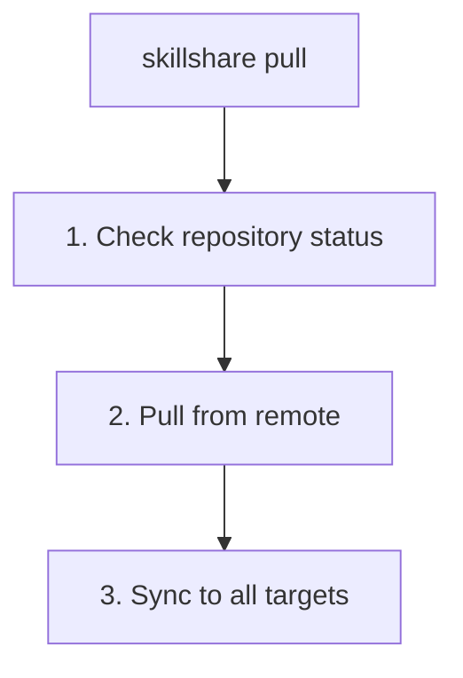

# pull

Pull from git remote and sync to all targets.

```bash
skillshare pull              # Pull and sync
skillshare pull --dry-run    # Preview
skillshare pull --force      # Replace local with remote on first pull
```

## When to Use

- Sync skills from another machine that pushed changes
- Get the latest skills after someone else pushed updates
- Start working on a new machine after `init --remote`

## What Happens



## Options

| Flag | Description |
|------|-------------|
| `--dry-run, -n` | Preview without making changes |
| `--force, -f` | On first pull conflict, replace local skills with remote |

## Prerequisites

Your source directory must be a git repository with a remote:

```bash
# Check if ready:
skillshare status
# Shows: Git: initialized with remote
```

## Local Changes Warning

If you have uncommitted changes, `pull` will fail:

```bash
$ skillshare pull
Local changes detected
  Run: skillshare push
  Or:  cd ~/.config/skillshare/skills && git stash
```

Solutions:
```bash
# Option 1: Push your changes first
skillshare push
skillshare pull

# Option 2: Stash your changes
cd ~/.config/skillshare/skills
git stash
skillshare pull
git stash pop
```

## First Pull Conflict (Exit Code != 0)

On first pull (no upstream yet), if both local and remote already contain skill directories,
`pull` stops with a non-zero exit code and **does not run sync**:

```bash
$ skillshare pull
Remote has skills, but local skills also exist
  Push local:  skillshare push
  Pull remote: skillshare pull --force  (replaces local with remote)
```

Choose one path:

```bash
# Keep local skills, push them
skillshare push

# Replace local with remote
skillshare pull --force
```

## Examples

```bash
# Standard pull (most common)
skillshare pull

# Preview what would happen
skillshare pull --dry-run

# Replace local with remote on first-pull conflict
skillshare pull --force
```

## Workflow

Typical workflow on a secondary machine:

```bash
# Start of day: get latest skills
skillshare pull

# ... work with AI tools ...

# End of day: share any new skills
skillshare collect claude    # If you created new skills
skillshare push -m "Add new skill"
```

## See Also

- [push](/docs/commands/push) — Push to remote
- [sync](/docs/commands/sync) — Manual sync without pull
- [Cross-Machine Sync](/docs/guides/cross-machine-sync) — Full setup
