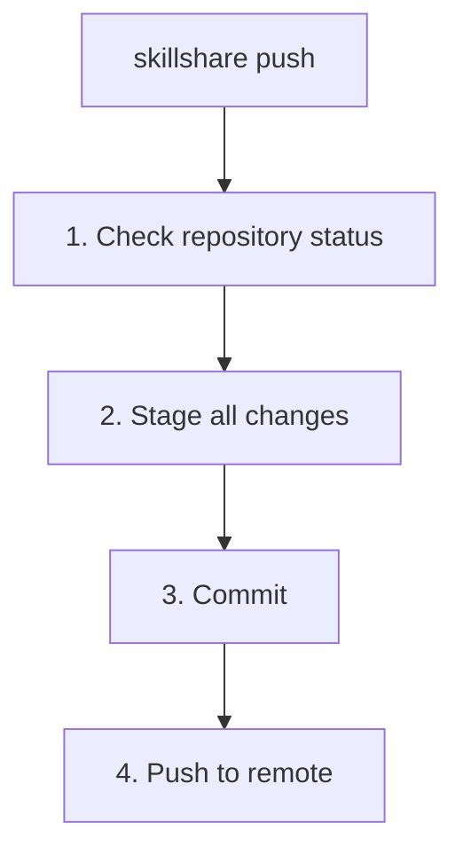

# push

Commit and push source to git remote.

```bash
skillshare push                  # Auto-generated message
skillshare push -m "Add pdf"     # Custom message
skillshare push --dry-run        # Preview
```

## When to Use

- Share skill changes with your other machines via git
- Back up your skills to a remote repository
- After editing skills, commit and push in one command

## What Happens



## Options

| Flag | Description |
|------|-------------|
| `-m, --message <msg>` | Commit message (default: "Update skills") |
| `--dry-run, -n` | Preview without making changes |

## Prerequisites

Your source directory must be a git repository with a remote:

```bash
# Set up during init (recommended):
skillshare init --remote git@github.com:you/my-skills.git

# Or add remote to existing setup:
skillshare init --remote git@github.com:you/my-skills.git
```

Init automatically creates the initial commit, so `push` works immediately after setup.

## First Push Upstream Mapping

On first push (no upstream tracking yet), `skillshare push` auto-configures upstream:

- If remote already has a default branch (for example `main` or `trunk`), local changes are pushed to that remote default branch.
- If remote is empty, it pushes to your current local branch.

This avoids accidentally creating the wrong remote branch (for example local `master` while remote uses `main`).

## Examples

```bash
# Quick push with auto message
skillshare push

# Custom commit message
skillshare push -m "Add commit-commands skill"

# Preview what would be pushed
skillshare push --dry-run
```

## Conflict Handling

If the remote has newer commits:

```bash
$ skillshare push
Push failed
  Remote may have newer changes
  Run: skillshare pull
  Then: skillshare push
```

Solution:
```bash
skillshare pull    # Get remote changes
skillshare push    # Push your changes
```

## Workflow

Typical workflow for sharing skills:

```bash
# 1. Make changes to skills
# 2. Push to remote
skillshare push -m "Update my-skill"

# On another machine:
skillshare pull    # Gets changes and syncs
```

## See Also

- [pull](/docs/commands/pull) — Pull from remote
- [sync](/docs/commands/sync) — Sync to local targets
- [Cross-Machine Sync](/docs/guides/cross-machine-sync) — Full setup
