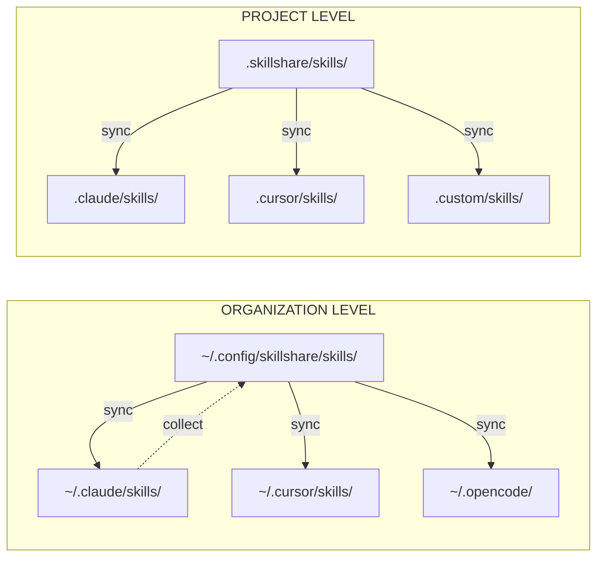

# Core Concepts

Understanding these concepts helps you get the most out of skillshare.

## What do you want to understand?

| Question | Read |
|----------|------|
| How does skillshare move skills around? | [Source & Targets](./source-and-targets.md) |
| What's the difference between merge and symlink? | [Sync Modes](./sync-modes.md) |
| How do I share organization-wide skills? | [Tracked Repositories](./tracked-repositories.md) |
| What goes inside a SKILL.md? | [Skill Format](./skill-format.md) |
| How do project-level skills work? | [Project Skills](./project-skills.md) |

## Overview

## Key Concepts

| Concept | What It Is | Learn More |
|---------|-----------|------------|
| **Source & Targets** | Single source of truth, multiple destinations | [→ Source & Targets](./source-and-targets.md) |
| **Sync Modes** | Merge, copy, symlink — how files are linked | [→ Sync Modes](./sync-modes.md) |
| **Tracked Repos** | Git repos installed with `--track` | [→ Tracked Repositories](./tracked-repositories.md) |
| **Skill Format** | SKILL.md structure and metadata | [→ Skill Format](./skill-format.md) |
| **Project Skills** | Project-level skills scoped to a repository | [→ Project Skills](./project-skills.md) |
| **Organization Skills** | Organization-wide skills via tracked repositories | [→ Organization-Wide Skills](/docs/guides/organization-sharing) |

---

## Quick Summary

### Source & Targets
- **Source**: `~/.config/skillshare/skills/` — where you edit skills
- **Targets**: AI CLI skill directories — where skills are deployed via symlinks

### Sync Modes
- **Merge** (default): Each skill symlinked individually, local skills preserved
- **Symlink**: Entire directory is one symlink

### Tracked Repos
- Git repos installed with `--track`
- Prefixed with `_` (e.g., `_team-skills/`)
- Updated via `skillshare update <name>`

### Skill Format
- `SKILL.md` with YAML frontmatter
- Required: `name` field
- Optional: `description`, custom metadata

### Project Skills
- Skills scoped to a single repository (`.skillshare/skills/`)
- Shared with team via git — auto-detected when `.skillshare/` exists
- Sync mode configurable per-target (merge default, symlink optional)

### Organization Skills
- Shared across all projects via tracked repositories (`--track`)
- Install once, update with `skillshare update --all`
- Complements project skills — organization for standards, project for repo context
