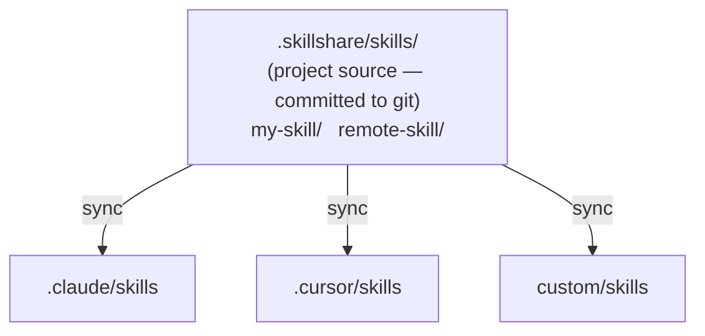

# Project Skills

Run skillshare at the project level — skills scoped to a single repository, shared via git.

:::tip When does this matter?
Use project skills when your team needs repo-specific AI instructions (coding standards, deployment guides, API conventions) that shouldn't be in your personal global skill collection.
:::

## Usage Scenarios

| Scenario | Example |
|----------|---------|
| **Monorepo onboarding** | New developer clones repo, runs `skillshare install -p && skillshare sync` — instant project context |
| **API conventions** | Embed API style guides as skills so every AI assistant follows team conventions |
| **Domain-specific context** | Finance app with regulatory rules, healthcare app with compliance guidelines |
| **Project tooling** | CI/CD deployment knowledge, testing patterns, migration scripts specific to this repo |
| **Onboarding acceleration** | "How does auth work here?" — the AI already knows, from committed project skills |
| **Open source projects** | Maintainers commit `.skillshare/` so contributors get project-specific AI context on clone |
| **Community skill curation** | A repo's `config.yaml` serves as a curated skill list — anyone can `install -p` to get the same setup |

---

## Overview



---

## Auto-Detection

Skillshare automatically enters project mode when `.skillshare/config.yaml` exists in the current directory:

```bash
cd my-project/           # Has .skillshare/config.yaml
skillshare sync          # → Project mode (auto-detected)
skillshare status        # → Project mode (auto-detected)
```

:::tip Zero Config
Just `cd` into any project with `.skillshare/` — skillshare detects it automatically. No flags, no environment variables, no configuration needed.
:::

To force a specific mode:

```bash
skillshare sync -p       # Force project mode
skillshare sync -g       # Force global mode
```

---

## Global vs Project

| | Global Mode | Project Mode |
|---|---|---|
| **Source** | `~/.config/skillshare/skills/` | `.skillshare/skills/` (project root) |
| **Config** | `~/.config/skillshare/config.yaml` | `.skillshare/config.yaml` |
| **Targets** | System-wide AI CLI directories | Per-project directories |
| **Sync mode** | Merge, copy, or symlink (per-target) | Merge, copy, or symlink (per-target, default merge) |
| **Tracked repos** | Supported (`--track`) | Supported (`--track -p`) |
| **Git integration** | Optional (`push`/`pull`) | Skills committed directly to project repo |
| **Scope** | All projects on machine | Single repository |

---

## `.skillshare/` Directory Structure

```
<project-root>/
├── .skillshare/
│   ├── config.yaml              # Targets + remote skills list
│   ├── .gitignore               # Ignores logs/ and cloned remote/tracked skill dirs
│   └── skills/
│       ├── my-local-skill/      # Created manually or via `skillshare new`
│       │   └── SKILL.md
│       ├── remote-skill/        # Installed via `skillshare install -p`
│       │   ├── SKILL.md
│       │   └── .skillshare-meta.json
│       ├── tools/               # Category folder (via --into tools)
│       │   └── pdf/             # Installed via `skillshare install ... --into tools -p`
│       │       ├── SKILL.md
│       │       └── .skillshare-meta.json
│       └── _team-skills/        # Installed via `skillshare install --track -p`
│           ├── .git/            # Git history preserved
│           ├── frontend/ui/
│           └── backend/api/
├── .claude/
│   └── skills/
│       ├── my-local-skill → ../../.skillshare/skills/my-local-skill
│       ├── remote-skill → ../../.skillshare/skills/remote-skill
│       ├── tools__pdf → ../../.skillshare/skills/tools/pdf
│       ├── _team-skills__frontend__ui → ../../.skillshare/skills/_team-skills/frontend/ui
│       └── _team-skills__backend__api → ../../.skillshare/skills/_team-skills/backend/api
└── .cursor/
    └── skills/
        └── (same symlink structure as .claude/skills/)
```

---

## Config Format

`.skillshare/config.yaml`:

```yaml
targets:
  - claude                    # Known target (uses default path)
  - cursor                         # Known target
  - name: custom-ide               # Custom target with explicit path
    path: ./tools/ide/skills
    mode: symlink                  # Optional: "merge" (default) or "symlink"
  - name: codex                    # Optional filters (merge mode)
    include: [codex-*]
    exclude: [codex-experimental-*]

skills:                            # Remote skills (auto-managed by install/uninstall)
  - name: pdf-skill
    source: anthropic/skills/pdf
  - name: _team-skills
    source: github.com/team/skills
    tracked: true                  # Tracked repo: cloned with git history
```

**Targets** support two formats:
- **Short**: Just the target name (e.g., `claude`). Uses known default path, merge mode.
- **Long**: Object with `name`, optional `path`, optional `mode` (`merge` or `symlink`), and optional `include`/`exclude` filters. Supports relative paths (resolved from project root) and `~` expansion.

**Skills** list tracks remote installations only. Local skills don't need entries here.

- `tracked: true`: Installed with `--track` (git repo with `.git/` preserved). When someone runs `skillshare install -p`, tracked skills are cloned with full git history so `skillshare update` works correctly.

:::tip Portable Skill Manifest
`config.yaml` is a portable skill manifest in both global and project mode. In a project, commit it to git and anyone can run `skillshare install -p && skillshare sync`. For global mode, copy `config.yaml` to a new machine and run `skillshare install && skillshare sync`. This works for teams, open source contributors, community templates, and dotfiles across machines.
:::

---

## Mode Restrictions

Project mode has some intentional limitations:

| Feature | Supported? | Notes |
|---------|-----------|-------|
| Merge sync mode | ✓ | Default, per-skill symlinks |
| Copy sync mode | ✓ | Per-target via `skillshare target <name> --mode copy -p` |
| Symlink sync mode | ✓ | Per-target via `skillshare target <name> --mode symlink -p` |
| `--track` repos | ✓ | Cloned to `.skillshare/skills/_repo/`, added to `.gitignore` (`logs/` is also ignored by default) |
| `--discover` | ✓ | Detect and add new targets to existing project config |
| `push` / `pull` | ✗ | Use git directly on the project repo |
| `collect` | ✓ | Collect local skills from project targets to `.skillshare/skills/` |
| `backup` / `restore` | ✗ | Not needed (project targets are reproducible) |

---

## When to Use: Project vs Organization

| Need | Use |
|------|-----|
| Skills specific to **one repo** (API style, deployment, domain rules) | **Project skills** — committed to the repo |
| Skills shared across **all projects** (coding standards, security audit) | **Organization skills** — tracked repos via `--track` |
| **Onboarding** a new member to a specific project | **Project skills** — clone + install + sync |
| **Onboarding** a new member to the organization | **Organization skills** — one install command |
| Both repo context **and** org standards | **Use both** — they coexist independently |

---

## See Also

- [Project Setup](/docs/guides/project-setup) — Step-by-step setup guide
- [Project Workflow](/docs/workflows/project-workflow) — Day-to-day project mode usage
- [Organization-Wide Skills](/docs/guides/organization-sharing) — Team-wide sharing
