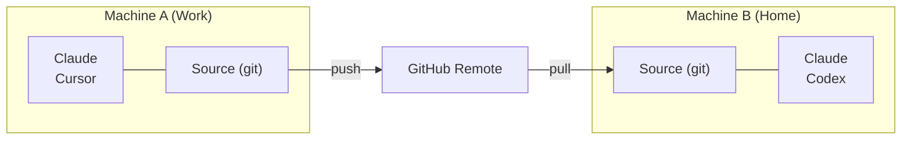

# Cross-Machine Sync

Sync your skills across multiple computers using git.

## Overview



---

## First Machine Setup

```bash
skillshare init --remote git@github.com:you/my-skills.git
```

This:
1. Creates source directory
2. Initializes git with initial commit
3. Adds remote
4. Auto-detects and configures targets

Then push your skills:
```bash
skillshare push
```

:::tip Already initialized?
Add a remote to an existing setup:
```bash
skillshare init --remote git@github.com:you/my-skills.git
```
This works even after initial setup — it just adds the remote.
:::

---

## Second Machine Setup

On a new machine, **the same command works**:

```bash
skillshare init --remote git@github.com:you/my-skills.git
```

Init automatically detects that the remote has existing skills and pulls them down. No manual `git clone` needed.

:::info What happens behind the scenes
1. Creates source directory and initializes git
2. Adds remote and runs `git fetch`
3. Detects remote has skills → resets local to match remote
4. Sets up tracking branch
5. Auto-detects and configures local targets
:::

If you prefer manual control:

```bash
# Clone directly, then init with existing source
git clone git@github.com:you/my-skills.git ~/.config/skillshare/skills
skillshare init --source ~/.config/skillshare/skills
skillshare sync
```

---

## Daily Workflow

### Machine A: Make changes and push

```bash
# Edit skills (changes visible immediately via symlinks)
$EDITOR ~/.config/skillshare/skills/my-skill/SKILL.md

# Push to remote
skillshare push -m "Update my-skill"
```

### Machine B: Pull and sync

```bash
skillshare pull
```

That's it. `pull` automatically runs `sync` after pulling.

---

## Commands

### Push

Commit and push local changes:

```bash
skillshare push                  # Auto-generated message
skillshare push -m "Add pdf"     # Custom message
```

**What happens:**
```
git add -A
git commit -m "Add pdf"
git push          # auto-sets upstream on first push
```

### Pull

Pull remote changes and sync:

```bash
skillshare pull
```

**What happens:**
```
git pull           # or fetch + reset on first pull
skillshare sync
```

---

## Conflict Handling

### Push fails (remote ahead)

```
$ skillshare push
Push failed
  Remote may have newer changes
  Run: skillshare pull
  Then: skillshare push
```

**Solution:**
```bash
skillshare pull
skillshare push
```

### Pull fails (local uncommitted changes)

```
$ skillshare pull
Local changes detected
  Run: skillshare push
  Or:  cd ~/.config/skillshare/skills && git stash
```

**Solution:**
```bash
# Option 1: Push your changes first
skillshare push -m "Local changes"
skillshare pull

# Option 2: Stash changes temporarily
cd ~/.config/skillshare/skills
git stash
skillshare pull
git stash pop
```

### Merge conflicts

```bash
cd ~/.config/skillshare/skills
git status                    # See conflicted files
# Edit files to resolve
git add .
git commit -m "Resolve conflicts"
skillshare sync
```

---

## Check Status

```bash
skillshare status
```

Shows:
- Git status (clean, ahead, behind)
- Remote configuration
- Sync status

---

## Private Repository

Use SSH URL for private repos:

```bash
skillshare init --remote git@github.com:you/private-skills.git
```

---

## Tips

### Use SSH keys

Set up SSH keys to avoid password prompts:
```bash
ssh-keygen -t ed25519 -C "your@email.com"
# Add public key to GitHub
```

### Multiple remotes

Add backup remotes:
```bash
cd ~/.config/skillshare/skills
git remote add backup git@gitlab.com:you/skills-backup.git
git push backup main
```

### Sync on shell startup

Add to `~/.bashrc` or `~/.zshrc`:
```bash
# Sync skillshare on terminal open (if remote configured)
skillshare pull 2>/dev/null
```

---

## Alternative: Install from Config

If you don't want to set up a git remote, `config.yaml` doubles as a portable skill manifest. Every `install` / `uninstall` auto-updates the `skills:` section, and `skillshare install` (no args) reinstalls everything listed:

```bash
# Machine A — config.yaml records what you installed
skillshare install anthropics/skills -s pdf
# config.yaml now has: skills: [{name: pdf, source: "..."}]

# Machine B — copy config.yaml, then:
skillshare install      # Installs all listed skills
skillshare sync
```

### When to use which

| | `push` / `pull` | `install` (no args) |
|---|---|---|
| What's synced | Actual skill files (full content) | Source URLs only — re-downloads on install |
| Local/hand-written skills | Included | Not included (no source URL) |
| Setup required | Git remote on source dir | Just `config.yaml` |
| Project mode | Global only | Works with `-p` (`.skillshare/config.yaml`) |
| Maintenance | Manual `push` after changes | Auto-reconciled on install/uninstall |

**Recommendation**: Use `push`/`pull` for personal cross-machine sync. Use `install` from config for team onboarding and project setup.

---

## See Also

- [push](/docs/commands/push) — Push to remote
- [pull](/docs/commands/pull) — Pull from remote
- [install](/docs/commands/install#install-from-config-no-arguments) — Install from config
- [Organization-Wide Skills](./organization-sharing.md) — Team sharing
- [init](/docs/commands/init) — Init with `--remote`
