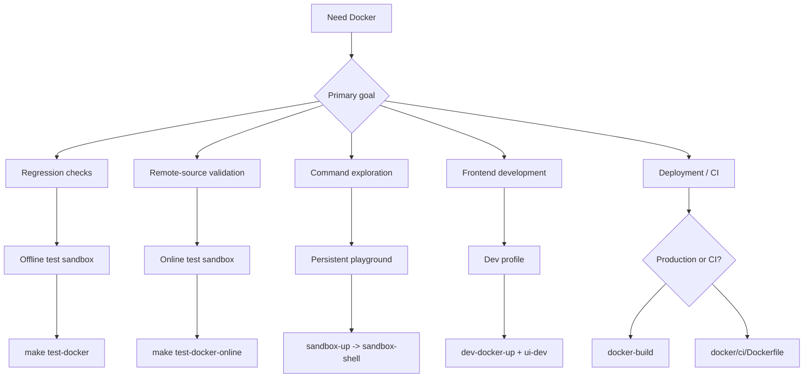

# Docker: Test, Develop, and Deploy

Use Docker for repeatable testing, frontend development without Go, production deployment, and automated skill validation in CI.

## Mode Selection Diagram



Command mapping:

| Shortcut | `mise` | `make` |
|---|---|---|
| `test-docker` | `mise run test:docker` | `make test-docker` |
| `test-docker-online` | `mise run test:docker:online` | `make test-docker-online` |
| `sandbox-up` | `mise run sandbox:up` | `make sandbox-up` |
| `sandbox-shell` | `mise run sandbox:shell` | `make sandbox-shell` |
| `sandbox-down` | `mise run sandbox:down` | `make sandbox-down` |
| `sandbox-status` | `mise run sandbox:status` | `make sandbox-status` |
| `dev-docker-up` | `mise run dev:docker:up` | `make dev-docker-up` |
| `dev-docker-down` | `mise run dev:docker:down` | `make dev-docker-down` |
| `docker-build` | `mise run docker:build` | `make docker-build` |
| `docker-build-multiarch` | `mise run docker:build:multiarch` | `make docker-build-multiarch` |

## What You Can Use It For

| Mode | Best for | Network | Lifecycle |
|------|----------|---------|-----------|
| Offline test sandbox | Stable regression checks (`build + unit + integration`) | Disabled | One-shot |
| Online test sandbox | Optional remote install/update checks | Enabled | One-shot |
| Interactive playground | Manual command exploration and demos | Enabled | Persistent |
| Dev profile | Go API server in Docker + Vite HMR on host | Enabled | Persistent |
| Production image | Lightweight deployment (`docker/production/`) | Enabled | Persistent |
| CI image | Skill validation in pipelines (`docker/ci/`) | Enabled | One-shot |

---

## Common Scenarios

### 1. Verify local install/update logic deterministically

Use this when you are changing `install` / `update` behavior and want a CI-like local gate.

```bash
mise run test:docker
make test-docker
```

This validates local-path and `file://` workflows in isolation.

### 2. Run optional remote-source checks

Use this for GitHub/remote-source validation that depends on network access.

```bash
mise run test:docker:online
make test-docker-online
```

### 3. Open a dedicated playground and explore all commands

```bash
mise run sandbox:up
mise run sandbox:shell
make sandbox-up
make sandbox-shell
```

Inside the playground, `skillshare` and `ss` are ready. Both global mode and project mode are pre-initialized:

```bash
skillshare --help
ss status
skillshare list
```

### Project Mode in the Playground

The playground automatically sets up a demo project at `~/demo-project` with a sample skill and a `claude` target. You can start exploring project mode right away:

```bash
cd ~/demo-project
skillshare status        # auto-detects project mode
skillshare list
skillshare sync --dry-run
```

To launch the project mode web dashboard, use the built-in alias:

```bash
skillshare-ui-p          # starts project mode dashboard on port 19420
```

Or run the command manually from the demo project directory:

```bash
cd ~/demo-project
skillshare ui -p --host 0.0.0.0 --no-open
```

Then open `http://localhost:19420` on your host machine.

### Web UI in the Playground

The playground container includes pre-built frontend assets and maps port 19420 to the host. Both global and project mode are pre-initialized, so you can launch the dashboard immediately:

```bash
skillshare-ui            # global mode dashboard
skillshare-ui-p          # project mode dashboard (~/demo-project)
```

Then open `http://localhost:19420` in your host browser. Use `--host 0.0.0.0` because the container's `127.0.0.1` is not reachable from the host.

### GitHub Token (for Search)

The playground automatically picks up your GitHub token from the host for `skillshare search`. It checks in order: `$GITHUB_TOKEN` → `$GH_TOKEN` → `gh auth token`. No extra setup needed if you're already authenticated on the host.

```bash
# If not detected, set it before starting the playground:
export GITHUB_TOKEN=ghp_your_token_here
make sandbox-up
```

When finished:

```bash
mise run sandbox:down
make sandbox-down
```

---

## Use Cases by Role

### Individual developers

| Scenario | What to use | What it replaces |
|----------|-------------|-----------------|
| Try skillshare without installing Go/Node | `docker run ghcr.io/runkids/skillshare` | Install Go + Node + pnpm, then build from source |
| Run full test suite before opening a PR | `make test-docker` | Depend on local toolchain (Go version mismatch = flaky results) |
| Frontend work without Go installed | `make dev-docker-up` + `make ui-dev` | Must install Go 1.25+ locally to run the API server |
| Demo skillshare to a colleague | `make sandbox-up` → Web UI on `:19420` | Walk them through a full local install |
| Verify Linux behavior on Apple Silicon | `make docker-build` | Push to CI and wait |

### Teams and open-source contributors

| Scenario | What to use | What it solves |
|----------|-------------|---------------|
| New contributor onboarding | `make sandbox-up` — one command, ready to go | No more "install Go, set PATH, clone, build" setup guide |
| Automated skill quality gate in CI | `docker run ghcr.io/.../skillshare-ci audit /skills` | Previously required installing Go + building from source in every workflow |
| "Works on my machine" across contributors | Docker pins Go 1.25.5 + all dependencies | Different local Go versions causing test flakes |
| PR reviewer reproducing an issue | `make test-docker --cmd "go test -run TestXxx ..."` | Must clone + full local setup to reproduce |

### Enterprise and self-hosted deployment

| Scenario | What to use | Value |
|----------|-------------|-------|
| Internal skill management dashboard | Production image + volume mount for skills | One container, no Go/Node on the server |
| Kubernetes deployment | Production image (healthcheck + graceful shutdown + non-root) | Ready for readiness/liveness probes, passes PodSecurityPolicy |
| Automated skill PR review | CI image + `skillshare audit` in GitHub Actions | Block unsafe skills from merging — one line in your workflow |
| Container security compliance | `read_only` + `cap_drop: ALL` + `no-new-privileges` | Passes CIS Docker Benchmark, Trivy, and Aqua scans |
| ARM servers (AWS Graviton) for cost savings | `make docker-build-multiarch` | Native arm64 image, no emulation overhead |

### Quick examples

**Self-hosted dashboard with persistent skills:**

```bash
docker run -d \
  -p 19420:19420 \
  -v skillshare-data:/home/skillshare/.config/skillshare \
  ghcr.io/runkids/skillshare
```

**CI skill audit in GitHub Actions:**

```yaml
- name: Audit skills
  run: |
    docker run --rm \
      -v ${{ github.workspace }}/skills:/skills \
      ghcr.io/runkids/skillshare-ci audit /skills
```

**Kubernetes deployment (minimal):**

```yaml
apiVersion: apps/v1
kind: Deployment
metadata:
  name: skillshare
spec:
  replicas: 1
  template:
    spec:
      containers:
        - name: skillshare
          image: ghcr.io/runkids/skillshare:latest
          ports:
            - containerPort: 19420
          livenessProbe:
            httpGet:
              path: /api/health
              port: 19420
          readinessProbe:
            httpGet:
              path: /api/health
              port: 19420
          securityContext:
            runAsNonRoot: true
            readOnlyRootFilesystem: true
```

---

## Dev Profile

Run the Go API server inside Docker while keeping Vite HMR on your host for fast frontend iteration:

```bash
# Terminal 1: Go API server in Docker
make dev-docker-up

# Terminal 2: Vite dev server on host
make ui-dev

# When done
make dev-docker-down
```

The dev profile reuses the sandbox image and mounts the source directory, so Go code changes are picked up on restart.

---

## Production and CI Images

### Production image

Build a lightweight production image with the embedded Web UI:

```bash
make docker-build                          # single platform
make docker-build-multiarch                # linux/amd64 + linux/arm64
```

The production image uses `tini` as PID 1, runs as a non-root user (UID 10001), includes a healthcheck, and auto-initialises config on first run. Default command: `skillshare ui -g --host 0.0.0.0 --no-open`.

### CI image

A minimal image for validating skills in CI pipelines:

```bash
docker build -f docker/ci/Dockerfile -t skillshare-ci .
docker run --rm -v ./my-skills:/skills skillshare-ci audit /skills
```

### Automated publishing

On tag push (`v*`), the `docker-publish` GitHub Actions workflow builds and pushes both production and CI images to GHCR with multi-arch support.

---

## Limits and Expectations

- Offline sandbox cannot validate network-dependent features (for example remote `install` from GitHub).
- Playground uses container-local `HOME`, so it does not directly modify your real host home config.
- Go code changes are picked up automatically (`go build` runs inside the container from mounted source). **Frontend (`ui/`) changes** require running `make ui-build` on the host first, since the container does not have Node.js.
- If you need custom experiments, pass commands directly:

```bash
./scripts/test_docker.sh --cmd "go test -v ./tests/integration/..."
./scripts/sandbox_playground_shell.sh "skillshare list"
```
