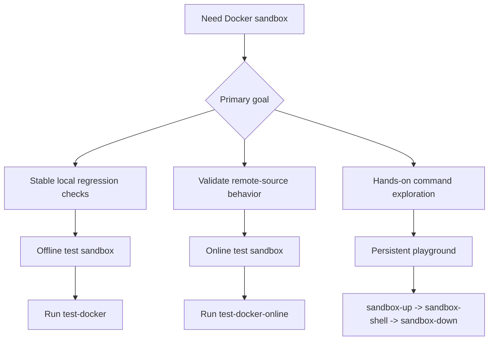

# Docker Sandbox: Test and Playground

Use Docker sandbox when you want repeatable verification and a safe place to try commands without touching your host setup.

## Mode Selection Diagram



Command mapping:

| Shortcut | `mise` | `make` |
|---|---|---|
| `test-docker` | `mise run test:docker` | `make test-docker` |
| `test-docker-online` | `mise run test:docker:online` | `make test-docker-online` |
| `sandbox-up` | `mise run sandbox:up` | `make sandbox-up` |
| `sandbox-shell` | `mise run sandbox:shell` | `make sandbox-shell` |
| `sandbox-down` | `mise run sandbox:down` | `make sandbox-down` |

## What You Can Use It For

| Mode | Best for | Network | Lifecycle |
|------|----------|---------|-----------|
| Offline test sandbox | Stable regression checks (`build + unit + integration`) | Disabled | One-shot |
| Online test sandbox | Optional remote install/update checks | Enabled | One-shot |
| Interactive playground | Manual command exploration and demos | Enabled | Persistent |

---

## Common Scenarios

### 1. Verify local install/update logic deterministically

Use this when you are changing `install` / `update` behavior and want a CI-like local gate.

```bash
mise run test:docker
make test-docker
```

This validates local-path and `file://` workflows in isolation.

### 2. Run optional remote-source checks

Use this for GitHub/remote-source validation that depends on network access.

```bash
mise run test:docker:online
make test-docker-online
```

### 3. Open a dedicated playground and explore all commands

```bash
mise run sandbox:up
mise run sandbox:shell
make sandbox-up
make sandbox-shell
```

Inside the playground, `skillshare` and `ss` are ready:

```bash
skillshare --help
ss status
skillshare init --dry-run
```

### Project Mode in the Playground

The playground automatically sets up a demo project at `~/demo-project` with a sample skill and a `claude` target. You can start exploring project mode right away:

```bash
cd ~/demo-project
skillshare status        # auto-detects project mode
skillshare list
skillshare sync --dry-run
```

To launch the project mode web dashboard, use the built-in alias:

```bash
skillshare-ui-p          # starts project mode dashboard on port 19420
```

Or run the command manually from the demo project directory:

```bash
cd ~/demo-project
skillshare ui -p --host 0.0.0.0 --no-open
```

Then open `http://localhost:19420` on your host machine.

### Web UI in the Playground

The playground container includes pre-built frontend assets and maps port 19420 to the host. To launch the global mode web dashboard:

```bash
skillshare init          # required before first use
skillshare-ui            # alias for: skillshare ui --host 0.0.0.0 --no-open
```

Then open `http://localhost:19420` in your host browser. Use `--host 0.0.0.0` because the container's `127.0.0.1` is not reachable from the host.

When finished:

```bash
mise run sandbox:down
make sandbox-down
```

---

## Why This Is Useful

- **Reproducible**: same base image, same toolchain, fewer machine-specific surprises.
- **Safe isolation**: test and experiment without polluting host-level paths.
- **Fast iteration**: separate offline/online modes let you keep default checks stable.
- **Team onboarding**: a shared command set (`mise run ...`) avoids setup drift.
- **Tooling flexibility**: use either `mise` or `make`, depending on team preference.

---

## Practical Benefits by Role

- **Maintainers**: faster confidence for command-level changes.
- **Contributors**: one command to run the expected test gate.
- **Power users**: a disposable environment for trying risky workflows.
- **Demo/training**: predictable environment for live walkthroughs.

---

## Limits and Expectations

- Offline sandbox cannot validate network-dependent features (for example remote `install` from GitHub).
- Playground uses container-local `HOME`, so it does not directly modify your real host home config.
- If you need custom experiments, pass commands directly:

```bash
./scripts/test_docker.sh --cmd "go test -v ./tests/integration/..."
./scripts/sandbox_playground_shell.sh "skillshare list"
```
