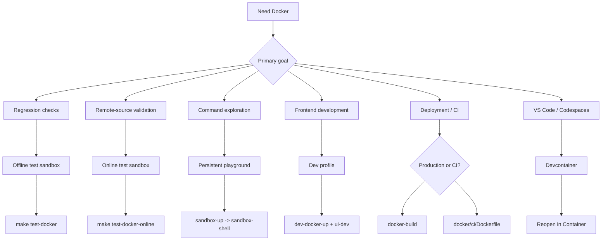

# Docker: Test, Develop, and Deploy

Use Docker for repeatable testing, frontend development without Go, production deployment, and automated skill validation in CI.

## Mode Selection Diagram



Command mapping:

| Shortcut | `mise` | `make` |
|---|---|---|
| `test-docker` | `mise run test:docker` | `make test-docker` |
| `test-docker-online` | `mise run test:docker:online` | `make test-docker-online` |
| `sandbox-up` | `mise run sandbox:up` | `make sandbox-up` |
| `sandbox-shell` | `mise run sandbox:shell` | `make sandbox-shell` |
| `sandbox-down` | `mise run sandbox:down` | `make sandbox-down` |
| `sandbox-status` | `mise run sandbox:status` | `make sandbox-status` |
| `sandbox-logs` | `mise run sandbox:logs` | `make sandbox-logs` |
| `dev-docker-up` | `mise run dev:docker:up` | `make dev-docker-up` |
| `dev-docker-down` | `mise run dev:docker:down` | `make dev-docker-down` |
| `dev-docker-watch` | `mise run dev:docker:watch` | `make dev-docker-watch` |
| `docker-build` | `mise run docker:build` | `make docker-build` |
| `docker-build-multiarch` | `mise run docker:build:multiarch` | `make docker-build-multiarch` |

## What You Can Use It For

| Mode | Best for | Network | Lifecycle |
|------|----------|---------|-----------|
| Offline test sandbox | Stable regression checks (`build + unit + integration`) | Disabled | One-shot |
| Online test sandbox | Optional remote install/update checks | Enabled | One-shot |
| Interactive playground | Manual command exploration and demos | Enabled | Persistent |
| Dev profile | Go API server in Docker + Vite HMR on host | Enabled | Persistent |
| Devcontainer | VS Code / Codespaces one-click dev environment | Enabled | Persistent |
| Production image | Lightweight deployment (`docker/production/`) | Enabled | Persistent |
| CI image | Skill validation in pipelines (`docker/ci/`) | Enabled | One-shot |

---

## Common Scenarios

### 1. Verify local install/update logic deterministically

Use this when you are changing `install` / `update` behavior and want a CI-like local gate.

```bash
mise run test:docker
make test-docker
```

This validates local-path and `file://` workflows in isolation.

### 2. Run optional remote-source checks

Use this for GitHub/remote-source validation that depends on network access.

```bash
mise run test:docker:online
make test-docker-online
```

### 3. Open a dedicated playground and explore all commands

```bash
mise run sandbox:up
mise run sandbox:shell
make sandbox-up
make sandbox-shell
```

Inside the playground, `skillshare` and `ss` are ready. Both global mode and project mode are pre-initialized:

```bash
skillshare --help
ss status
skillshare list
```

### Project Mode in the Playground

The playground automatically sets up a demo project at `~/demo-project` with a sample skill and a `claude` target. You can start exploring project mode right away:

```bash
cd ~/demo-project
skillshare status        # auto-detects project mode
skillshare list
skillshare sync --dry-run
```

To launch the project mode web dashboard, use the built-in alias:

```bash
skillshare-ui-p          # starts project mode dashboard on port 19420
```

Or run the command manually from the demo project directory:

```bash
cd ~/demo-project
skillshare ui -p --host 0.0.0.0 --no-open
```

Then open `http://localhost:19420` on your host machine.

### Web UI in the Playground

The playground container includes pre-built frontend assets and maps port 19420 to the host. Both global and project mode are pre-initialized, so you can launch the dashboard immediately:

```bash
skillshare-ui            # global mode dashboard
skillshare-ui-p          # project mode dashboard (~/demo-project)
```

Then open `http://localhost:19420` in your host browser. Use `--host 0.0.0.0` because the container's `127.0.0.1` is not reachable from the host.

### GitHub Token (for Search)

The playground automatically picks up your GitHub token from the host for `skillshare search`. It checks in order: `$GITHUB_TOKEN` → `$GH_TOKEN` → `gh auth token`. No extra setup needed if you're already authenticated on the host.

```bash
# If not detected, set it before starting the playground:
export GITHUB_TOKEN=ghp_your_token_here
make sandbox-up
```

When finished:

```bash
mise run sandbox:down
make sandbox-down
```

---

## Use Cases by Role

### Individual developers

| Scenario | What to use | What it replaces |
|----------|-------------|-----------------|
| Try skillshare without installing Go/Node | `docker run ghcr.io/runkids/skillshare` | Install Go + Node + pnpm, then build from source |
| Run full test suite before opening a PR | `make test-docker` | Depend on local toolchain (Go version mismatch = flaky results) |
| Frontend work without Go installed | `make dev-docker-up` + `make ui-dev` | Must install Go 1.25+ locally to run the API server |
| Demo skillshare to a colleague | `make sandbox-up` → Web UI on `:19420` | Walk them through a full local install |
| Verify Linux behavior on Apple Silicon | `make docker-build` | Push to CI and wait |

### Teams and open-source contributors

| Scenario | What to use | What it solves |
|----------|-------------|---------------|
| New contributor onboarding | `make sandbox-up` — one command, ready to go | No more "install Go, set PATH, clone, build" setup guide |
| Automated skill quality gate in CI | `docker run ghcr.io/.../skillshare-ci audit /skills` | Previously required installing Go + building from source in every workflow |
| "Works on my machine" across contributors | Docker pins Go 1.25.5 + all dependencies | Different local Go versions causing test flakes |
| PR reviewer reproducing an issue | `make test-docker --cmd "go test -run TestXxx ..."` | Must clone + full local setup to reproduce |

### Enterprise and self-hosted deployment

| Scenario | What to use | Value |
|----------|-------------|-------|
| Internal skill management dashboard | Production image + volume mount for skills | One container, no Go/Node on the server |
| Kubernetes deployment | Production image (healthcheck + graceful shutdown + non-root) | Ready for readiness/liveness probes, passes PodSecurityPolicy |
| Automated skill PR review | CI image + `skillshare audit` in GitHub Actions | Block unsafe skills from merging — one line in your workflow |
| Container security compliance | `read_only` + `cap_drop: ALL` + `no-new-privileges` | Passes CIS Docker Benchmark, Trivy, and Aqua scans |
| ARM servers (AWS Graviton) for cost savings | `make docker-build-multiarch` | Native arm64 image, no emulation overhead |

### Quick examples

**Self-hosted dashboard with persistent skills:**

```bash
docker run -d \
  -p 19420:19420 \
  -v skillshare-data:/home/skillshare/.config/skillshare \
  ghcr.io/runkids/skillshare
```

**CI skill audit in GitHub Actions:**

```yaml
- name: Audit skills
  run: |
    docker run --rm \
      -v ${{ github.workspace }}/skills:/skills \
      ghcr.io/runkids/skillshare-ci audit /skills
```

**Kubernetes deployment (minimal):**

```yaml
apiVersion: apps/v1
kind: Deployment
metadata:
  name: skillshare
spec:
  replicas: 1
  template:
    spec:
      containers:
        - name: skillshare
          image: ghcr.io/runkids/skillshare:latest
          ports:
            - containerPort: 19420
          livenessProbe:
            httpGet:
              path: /api/health
              port: 19420
          readinessProbe:
            httpGet:
              path: /api/health
              port: 19420
          securityContext:
            runAsNonRoot: true
            readOnlyRootFilesystem: true
```

---

## Dev Profile

Two ways to develop the frontend with Vite HMR:

**With Go installed locally** (single command):

```bash
make ui-dev              # starts Go API server + Vite dev server together
# Open http://localhost:5173
```

**Without Go** (Go API runs in Docker):

```bash
# Terminal 1
make dev-docker-up       # Go API server in Docker (localhost:19420)

# Terminal 2
cd ui && pnpm run dev    # Vite dev server (localhost:5173, proxies /api → :19420)

# When done
make dev-docker-down
```

Both approaches give you instant HMR for `ui/` changes. The Docker variant pins the Go toolchain so backend behavior is consistent across contributors.

**With Docker Compose Watch** (auto-rebuild on Go changes):

```bash
# Terminal 1
make dev-docker-watch    # watches cmd/, internal/, go.mod — auto-rebuilds on change

# Terminal 2
cd ui && pnpm run dev    # Vite dev server (localhost:5173, proxies /api → :19420)
```

When you edit Go files, Compose Watch detects the change, rebuilds the container, and restarts the API server automatically. No manual restart needed. Requires Docker Compose v2.22+.

**Note:** Without Compose Watch, Go code changes require restarting the server — `Ctrl+C` and re-run for `make ui-dev`, or `make dev-docker-down && make dev-docker-up` for Docker.

---

## Devcontainer (VS Code / Codespaces)

Open the project in a ready-to-code container — no local Go, Node, or pnpm needed.

:::info Devcontainer vs Playground
Both use the same base image and demo content. The **playground** (`make sandbox-up`) is a terminal-only environment for exploring commands. The **devcontainer** adds VS Code integration (IntelliSense, debugger, extensions) for developing the skillshare codebase itself.
:::

### Prerequisites

- [Docker Desktop](https://www.docker.com/products/docker-desktop/) running
- VS Code with the [Dev Containers](https://marketplace.visualstudio.com/items?itemName=ms-vscode-remote.remote-containers) extension installed

:::tip GitHub Codespaces
On GitHub, click **Code → Codespaces → New codespace**. The devcontainer config is picked up automatically — no local Docker or extension needed.
:::

### Getting started

1. Open the project folder in VS Code
2. Press `Ctrl+Shift+P` (or `Cmd+Shift+P` on macOS) and select **Dev Containers: Reopen in Container**
3. Wait for the container to build (first time takes a few minutes, subsequent opens are fast)
4. Once ready, the setup script builds the binary and creates demo skills automatically

### What's included

The devcontainer reuses the same `docker/sandbox/Dockerfile` as the sandbox, so you get:

- Go 1.25 toolchain
- Node.js 24 + pnpm (via [devcontainer feature](https://github.com/devcontainers/features/tree/main/src/node)) — enables `make ui-dev` and `cd website && pnpm start` inside the container
- VS Code extensions: Go, Tailwind CSS, ESLint, Prettier
- Ports forwarded: `19420` (Web UI), `5173` (Vite HMR), `3000` (Docusaurus)
- Source code mounted at `/workspace`
- **Pre-configured demo environment** — same as the interactive playground:
  - Shortcut commands in PATH (`ss`, `ui`, `ui-p`, `docs`, `dev-servers`)
  - Frontend dependencies pre-installed (`ui/` and `website/`)
  - Global demo skills (audit examples, deploy checklist)
  - Custom audit rules (global + project)
  - Demo project at `~/demo-project` with project-mode skills

### Quick start after container opens

```bash
ss status                 # global mode — already initialized
ss list                   # see demo skills (flat + nested)
ss audit                  # run audit with custom rules

cd ~/demo-project
ss status                 # auto-detects project mode
ss audit                  # project-level audit
ui-p                      # switch to project mode dashboard (:19420)
```

### Frontend development

All three dev servers start automatically when the container opens:

| Port | Service | What it serves |
|------|---------|----------------|
| `19420` | Go API server | REST API backend |
| `5173` | Vite | React UI with hot reload |
| `3000` | Docusaurus | Documentation site with hot reload |

Open `http://localhost:5173` (UI) or `http://localhost:3000` (docs) in your host browser — they're ready immediately.
These URLs are available via Dev Containers port forwarding (no fixed host port bind in `.devcontainer/docker-compose.yml`).

**Managing dev servers:**

```bash
dev-servers status              # check which servers are running
dev-servers restart             # restart all
dev-servers restart vite        # restart just Vite
dev-servers stop docusaurus     # stop just Docusaurus
dev-servers logs api            # tail Go API server log
```

Servers shut down automatically when the container stops and restart on the next container start.

### Running the Web UI inside the container

```bash
ui                        # global mode dashboard (auto-started by dev-servers)
ui-p                      # switch to project mode (stops global, Ctrl-C to return)
docs                      # open documentation site (:3000)

# VS Code auto-forwards port 19420 → open http://localhost:19420
```

### Running tests

```bash
make test          # unit + integration
make test-unit     # unit only
make lint          # go vet
```

---

## Production and CI Images

### Production image

Build a lightweight production image with the embedded Web UI:

```bash
make docker-build                          # current platform only (fast, for local testing)
make docker-build-multiarch                # linux/amd64 + linux/arm64 (slow, for registry push)
```

`docker-build` only produces an image for your machine's architecture — an arm64 image from Apple Silicon won't run on x86 servers. Use `docker-build-multiarch` when pushing to a registry so any platform gets the right image automatically.

The production image uses `tini` as PID 1, runs as a non-root user (UID 10001), includes a healthcheck, and auto-initialises config on first run. Default command: `skillshare ui -g --host 0.0.0.0 --no-open`.

Published images are available on GHCR (pushed automatically on tag):

```bash
# Pull and run (auto-selects amd64 or arm64)
docker run -d -p 19420:19420 ghcr.io/runkids/skillshare

# With persistent skill data
docker run -d -p 19420:19420 \
  -v skillshare-data:/home/skillshare/.config/skillshare \
  ghcr.io/runkids/skillshare
```

### CI image

A minimal image for validating skills in CI pipelines:

```bash
docker build -f docker/ci/Dockerfile -t skillshare-ci .
docker run --rm -v ./my-skills:/skills skillshare-ci audit /skills
```

### Automated publishing

On tag push (`v*`), the `docker-publish` GitHub Actions workflow builds and pushes both production and CI images to GHCR with multi-arch support. Browse published versions at [GitHub Packages](https://github.com/runkids/skillshare/pkgs/container/skillshare).

---

## Limits and Expectations

- **Playground and dev profile share port 19420** — run only one at a time. Stop the other first (`make sandbox-down` or `make dev-docker-down`).
- Offline sandbox cannot validate network-dependent features (for example remote `install` from GitHub).
- Playground uses container-local `HOME`, so it does not directly modify your real host home config.
- Go code changes are picked up automatically (`go build` runs inside the container from mounted source). **Frontend (`ui/`) changes** are picked up instantly when running `make ui-dev` (Vite HMR) inside the devcontainer. For the playground, run `make ui-build` on the host first since the playground container does not include Node.js.
- If you need custom experiments, pass commands directly:

```bash
./scripts/test_docker.sh --cmd "go test -v ./tests/integration/..."
./scripts/sandbox_playground_shell.sh "skillshare list"
```

---

## See Also

- [Getting Started](/docs/getting-started) — Standard setup
- [Commands Reference](/docs/commands) — All commands
- [Troubleshooting](/docs/troubleshooting) — Common issues
