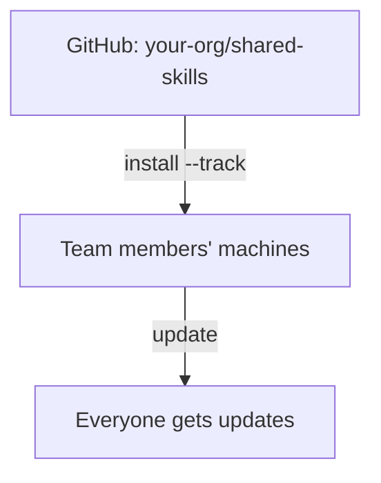

# Organization-Wide Skills

Share skills across all projects using tracked repositories.

## Overview



---

## Usage Scenarios

| Scenario | Example |
|----------|---------|
| **Company coding standards** | Enforce consistent naming, error handling, and architecture across all repos |
| **Security audit skills** | Organization-wide security review checklist applied to every project |
| **Deployment knowledge** | Standard CI/CD patterns, infrastructure conventions, release processes |
| **Code review guidelines** | Consistent review criteria across all teams and projects |
| **Cross-project patterns** | Shared API design patterns, logging standards, testing frameworks |

---

## Why Organization Sharing?

| Without Organization Skills | With Organization Skills |
|-----------------------------|--------------------------|
| "Hey, grab the latest deploy skill from Slack" | `skillshare update --all` |
| Copy-paste skills between machines | One command installs everything |
| "Which version of the skill do you have?" | Everyone syncs from same source |
| Skills scattered across docs/repos | One curated repo for the organization |

---

## For Team Leads

### Step 1: Create a skills repo

Create a GitHub/GitLab/Bitbucket repository for your organization's skills.

```bash
mkdir org-skills && cd org-skills
git init

# Create skill structure
mkdir -p frontend/ui backend/api devops/deploy

# Add skills
echo "---
name: acme:ui
description: Frontend UI patterns
---
# UI Skill
..." > frontend/ui/SKILL.md

git add .
git commit -m "Initial skills"
git push -u origin main
```

### Step 2: Add .skillignore (optional)

If your repo has internal tooling or CI scripts that shouldn't be discovered as skills, create a `.skillignore` at the repo root:

```text title=".skillignore"
# CI/CD helpers — not installable skills
ci-scripts
_internal-*
```

### Step 3: Share the install command

Send this to your team:

```bash
skillshare install github.com/your-org/org-skills --track && skillshare sync
```

Team members who only need a subset can use `--exclude`:

```bash
skillshare install github.com/your-org/org-skills --all --exclude devops-deploy
```

---

## For Team Members

### Initial setup

```bash
# Install the organization skills repo
skillshare install github.com/org/skills --track

# Sync to your AI CLIs
skillshare sync
```

### Daily usage

```bash
# Check for updates
skillshare update --all
skillshare sync
```

---

## Nested Skills & Auto-Flattening

Organize skills in folders — skillshare auto-flattens them for AI CLI compatibility:

```
SOURCE                              TARGET
(your organization)                 (what AI CLI sees)
────────────────────────────────────────────────────────────
_org-skills/
├── frontend/
│   ├── react/          ───►   _org-skills__frontend__react/
│   └── vue/            ───►   _org-skills__frontend__vue/
├── backend/
│   └── api/            ───►   _org-skills__backend__api/
└── devops/
    └── deploy/         ───►   _org-skills__devops__deploy/

• _ prefix = tracked repository
• __ (double underscore) = path separator
```

**Benefits:**
- Keep logical folder organization in your repo
- AI CLIs see flat structure they expect
- Flattened names preserve origin path for traceability

See [Tracked Repositories](/docs/concepts/tracked-repositories#nested-skills--auto-flattening) for details.

---

## Collision Detection

When multiple skills share the same `name` field, sync checks whether they actually land on the same target after `include`/`exclude` filters are applied.

**Filters isolate the collision** — informational only:

```
ℹ Duplicate skill names exist but are isolated by target filters:
  'ui' (2 definitions)
```

**Collision reaches the same target** — actionable warning:

```
⚠ Target 'claude': skill name 'ui' is defined in multiple places:
  - _team-a/frontend/ui
  - _team-b/components/ui
Rename one in SKILL.md or adjust include/exclude filters
```

**Solution:** Use namespaced names or route with filters:

```yaml
# Option 1: Namespace in SKILL.md
name: team-a:ui

# Option 2: Route with filters (global config)
targets:
  codex:
    path: ~/.codex/skills
    include: [_team-a__*]
  claude:
    path: ~/.claude/skills
    include: [_team-b__*]
```

```yaml
# Option 2: Route with filters (project config)
targets:
  - name: claude
    exclude: [codex-*]
  - name: codex
    include: [codex-*]
```

See [Target Filters](/docs/targets/configuration#include--exclude-target-filters) for full syntax and examples.

---

## Multiple Organization Repos

Install multiple repos for different teams or concerns:

```bash
# Frontend team
skillshare install github.com/org/frontend-skills --track --name frontend

# Backend team
skillshare install github.com/org/backend-skills --track --name backend

# DevOps team
skillshare install github.com/org/devops-skills --track --name devops

skillshare sync
```

Update all:
```bash
skillshare update --all
skillshare sync
```

---

## Private Repositories

**SSH** (recommended for developer machines):

```bash
skillshare install git@github.com:org/private-skills.git --track
```

**HTTPS with token** (recommended for CI/CD):

```bash
export GITHUB_TOKEN=ghp_your_token
skillshare install https://github.com/org/private-skills.git --track
```

Official token documentation:
- GitHub: [Managing your personal access tokens](https://docs.github.com/en/authentication/keeping-your-account-and-data-secure/managing-your-personal-access-tokens)
- GitLab: [Token overview](https://docs.gitlab.com/security/tokens/)
- Bitbucket: [Access tokens](https://support.atlassian.com/bitbucket-cloud/docs/access-tokens/)

### CI/CD Setup

**GitHub Actions:**

```yaml
- name: Install org skills
  env:
    GITHUB_TOKEN: ${{ secrets.GITHUB_TOKEN }}
  run: |
    skillshare install https://github.com/org/skills.git --track
    skillshare sync
```

**GitLab CI:**

```yaml
install-skills:
  script:
    - skillshare install https://gitlab.com/org/skills.git --track
    - skillshare sync
  variables:
    GITLAB_TOKEN: $CI_JOB_TOKEN
```

**Bitbucket Pipelines:**

```yaml
- step:
    name: Install org skills
    script:
      - skillshare install https://bitbucket.org/team/skills.git --track
      - skillshare sync
    env:
      BITBUCKET_USERNAME: $BITBUCKET_USERNAME   # for app passwords
      BITBUCKET_TOKEN: $BITBUCKET_TOKEN
```

See [Environment Variables](/docs/reference/environment-variables#git-authentication) for all supported tokens.

---

## Commands Reference

| Command | Description |
|---------|-------------|
| `install <url> --track` | Clone repo as tracked repository |
| `update <name>` | Git pull specific tracked repo |
| `update --all` | Update all tracked repos |
| `uninstall <name>...` | Remove tracked repo(s) |
| `list` | List all skills and tracked repos |
| `status` | Show sync status |

---

## Organization vs Project Skills

| | Organization Skills | Project Skills |
|---|---|---|
| **Scope** | All projects on machine | Single repository |
| **Source** | `~/.config/skillshare/skills/_repo/` | `.skillshare/skills/` |
| **Install** | `skillshare install <url> --track` | `skillshare install <url> -p` |
| **Shared via** | Each member installs tracked repo | Committed to project git repo |
| **Best for** | Coding standards, security, org patterns | API conventions, domain context, project tooling |
| **Coexistence** | Works alongside project skills | Works alongside organization skills |

:::tip Use Both
Organization skills provide company-wide standards. Project skills provide repo-specific context. They complement each other — use both for the best developer experience.
:::

---

## Best Practices

### For Team Leads

1. **Use clear structure**: Organize by function (frontend, backend, devops)
2. **Namespace skills**: `org:skill-name` to avoid collisions
3. **Document requirements**: README with setup instructions
4. **Version control**: Use tags for stable releases

### For Team Members

1. **Update regularly**: `skillshare update --all` daily
2. **Report issues**: If a skill doesn't work, tell the maintainer
3. **Suggest improvements**: Open PRs to the skills repo

---

## See Also

- [Tracked Repositories](/docs/concepts/tracked-repositories) — Concept details
- [install](/docs/commands/install) — Install with `--track`
- [update](/docs/commands/update) — Update tracked repos
- [Project Setup](./project-setup.md) — Project-level sharing
- [Cross-Machine Sync](./cross-machine-sync.md) — Personal sync
