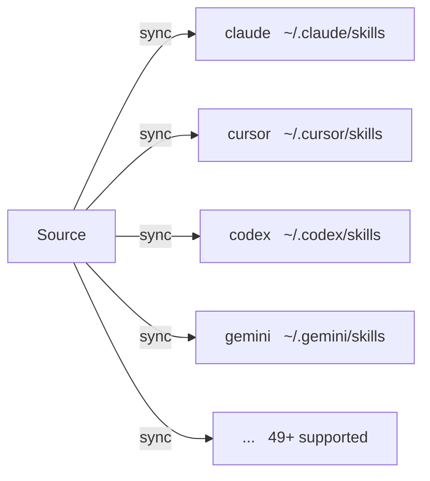

# Targets

Targets are AI CLI skill directories that skillshare syncs to.

## Overview



## What do you want to do?

| I want to... | Read |
|--------------|------|
| See which AI CLIs are supported | [Supported Targets](./supported-targets.md) |
| Add a target not in the built-in list | [Adding Custom Targets](./adding-custom-targets.md) |
| Configure sync mode, filters, or paths | [Configuration](./configuration.md) |

## Quick Links

| Topic | Description |
|-------|-------------|
| [Supported Targets](./supported-targets.md) | Complete list of 49+ supported AI CLIs |
| [Adding Custom Targets](./adding-custom-targets.md) | Add any tool with a skills directory |
| [Configuration](./configuration.md) | Config file reference |

---

## Common Operations

### List targets

```bash
skillshare target list
```

### Show target details

```bash
skillshare target claude
```

### Change sync mode

```bash
skillshare target claude --mode symlink
skillshare sync
```

### Add custom target

```bash
skillshare target add myapp ~/.myapp/skills
skillshare sync
```

### Remove target

```bash
skillshare target remove claude
```

---

## Auto-Detection

When running `skillshare init`, installed AI CLIs are automatically detected and added as targets.

Only paths that exist are added. See [Supported Targets](./supported-targets.md) for the full list of checked paths.

---

## Related

- [Source & Targets](/docs/concepts/source-and-targets) — Core concepts
- [Sync Modes](/docs/concepts/sync-modes) — Merge, copy, symlink
- [Commands: target](/docs/commands/target) — Target command details
